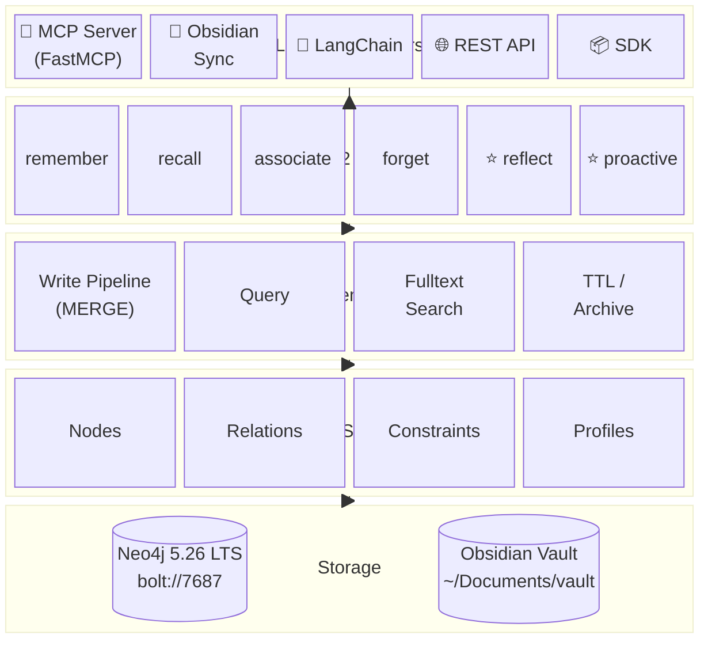
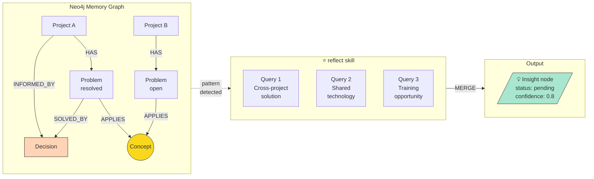
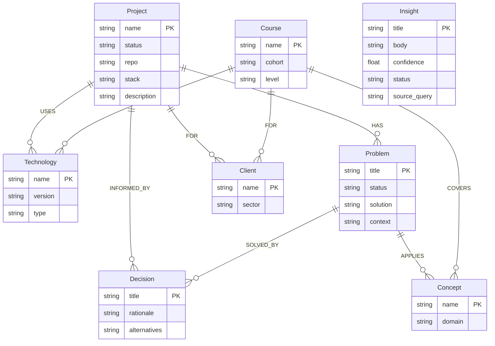
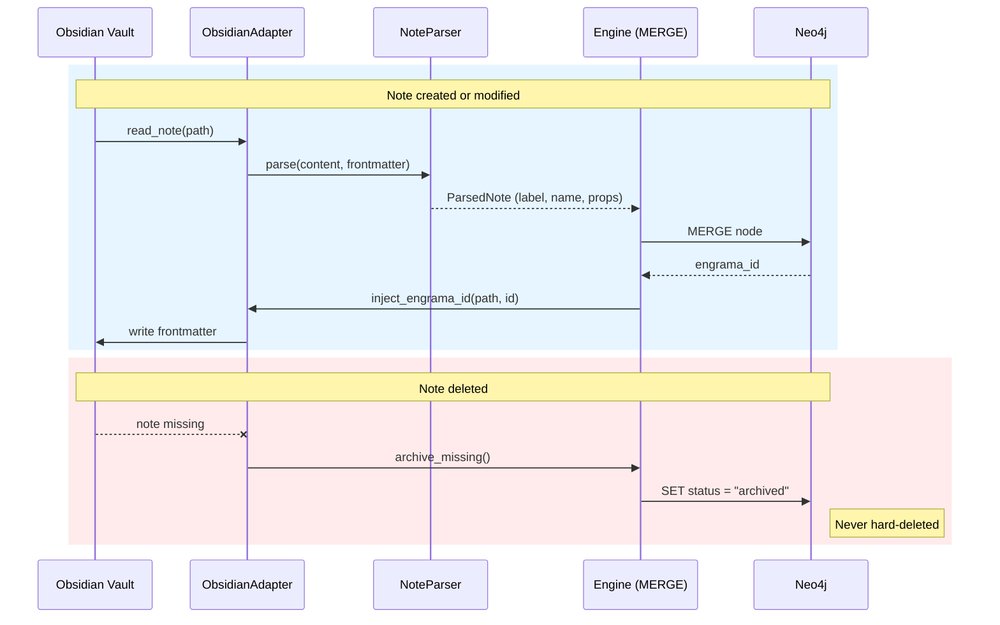

# Architecture

> Primary technical briefing document. Claude Code must read this before writing any code.

## Stack

| Component | Technology | Version | Reason |
|---|---|---|---|
| Database | Neo4j Community | 5.26.24 LTS | Free, local, supported until June 2028 |
| Language | Python | ≥ 3.11 | Agent ecosystem, FastMCP compatibility |
| Dependency mgmt | uv | latest | Modern standard, fast |
| MCP adapter | FastMCP + neo4j async | native | Full Cypher control, no intermediate layer |
| Obsidian adapter | Local Obsidian MCP server | stdio | Document ↔ graph sync |
| Container | Docker Desktop | latest | Reproducible infrastructure |
| CI/CD | GitHub Actions | — | Tests and PyPI publishing |
| Packaging | pyproject.toml | — | Installable as `pip install engrama` |

## What makes Engrama different

Engrama is not another MCP wrapper for Neo4j. It is a **cognitive framework**
combining two complementary layers:

- **Obsidian** — narrative memory (documents, reasoning, full context)
- **Neo4j** — relational memory (entities, relationships, patterns)

The `reflect` and `proactive` skills traverse the graph to surface connections
that neither layer could find alone. Example: a Problem in Project B shares a
Concept with a resolved Problem in Project A — Engrama detects this and
proposes the existing Decision as a solution candidate, without being asked.

## Layer diagram



## Data flow: reflect → Insight



## Graph schema



## Directory structure

```
engrama/
├── README.md
├── VISION.md
├── ARCHITECTURE.md
├── GRAPH-SCHEMA.md
├── ROADMAP.md
├── CONTRIBUTING.md
├── CHANGELOG.md
├── pyproject.toml
├── docker-compose.yml
├── .env.example
│
├── engrama/
│   ├── __init__.py
│   │
│   ├── core/
│   │   ├── client.py        # Neo4j driver, connection pool, health check
│   │   ├── engine.py        # write pipeline (MERGE+timestamps), query, fulltext
│   │   └── schema.py        # Python dataclasses for nodes and relationships
│   │
│   ├── skills/
│   │   ├── remember.py      # MERGE entity + observation
│   │   ├── recall.py        # fulltext search + graph traversal
│   │   ├── associate.py     # create relationships between entities
│   │   ├── reflect.py       # ★ cross-entity pattern detection
│   │   ├── proactive.py     # ★ surfaces Insights without being asked
│   │   ├── forget.py        # decay, archiving, TTL
│   │   └── summarize.py     # (planned — Phase 9) condense subgraph into synthesis node
│   │
│   ├── adapters/
│   │   ├── mcp/             # MCP server (FastMCP + neo4j async driver)
│   │   ├── obsidian/        # ★ Obsidian MCP adapter — document ↔ graph sync
│   │   │   ├── adapter.py   # vault file I/O (mirrors obsidian-mcp tools)
│   │   │   ├── parser.py    # extracts entities from note frontmatter + content
│   │   │   └── sync.py      # bidirectional sync via engrama_id
│   │   ├── langchain/
│   │   ├── rest/
│   │   └── sdk/
│   │
│   └── ingest/
│       ├── conversation.py  # extract entities from conversation transcripts
│       └── web.py           # URLs, RSS feeds
│                            # (document ingestion → adapters/obsidian/)
│
├── profiles/
│   ├── base.yaml             # Universal base (Project, Concept, Decision, ...)
│   ├── developer.yaml        # Standalone example profile
│   └── modules/
│       ├── hacking.yaml      # Domain module examples
│       ├── teaching.yaml     # (users create their own for any domain)
│       ├── photography.yaml
│       └── ai.yaml
│
├── scripts/
│   └── init-schema.cypher
│
├── examples/
│   ├── claude_desktop/
│   │   ├── config.json
│   │   └── system-prompt.md
│   └── langchain_agent/
│
└── tests/
    ├── conftest.py
    ├── test_core.py
    ├── test_skills.py
    ├── test_adapters.py
    └── test_obsidian_sync.py
```

## Obsidian integration

The vault is the **narrative layer**. Neo4j is the **relational layer**.
Neither replaces the other. The local Obsidian MCP server is a custom stdio
implementation that handles vault file I/O operations.

### Referential integrity via engrama_id

Every documented node (Project, Course) carries `engrama_id` in its note's
YAML frontmatter. `adapters/obsidian/sync.py` maintains the contract:



### Obsidian sync

All vault notes are candidates for sync.  The parser infers the node label
from frontmatter (`engrama_label:`) or folder structure.  Notes that cannot
be classified are skipped.  The `ObsidianAdapter` handles all file I/O
directly — no external MCP server dependency.

| Operation | Module | Purpose |
|---|---|---|
| Read note | `adapter.py` | Extract content + frontmatter |
| Search notes | `adapter.py` | Find related notes by text |
| List notes | `adapter.py` | Full vault scan |
| Inject engrama_id | `adapter.py` | Bidirectional sync identity |
| `vault_create_note` | proactive.py | write Insight notes back to vault |
| `vault_append_note` | proactive.py | add insight section to existing notes |

### frontmatter extensions in the local MCP server

The local Obsidian MCP server currently generates `date` and `tags` in frontmatter.
Engrama extends this by injecting `engrama_id` — making it a first-class frontmatter
citizen for bidirectional sync between notes and the Neo4j graph.

## The distinctive skills: reflect + proactive + ingest

`skills/reflect.py` runs **adaptive** cross-entity pattern detection. Before
executing any Cypher, it profiles the graph (counts labels with data) and only
runs patterns whose preconditions are met. Seven detection patterns:

1. **Cross-project solution** — Problems sharing Concepts with resolved Problems in other Projects
2. **Shared technology** — any two entities connected to the same Technology via USES/TEACHES/COMPOSED_OF
3. **Training opportunity** — Vulnerabilities or open Problems linked to Concepts that a Course covers
4. **Technique transfer** — Techniques used in 2+ Domains
5. **Concept clustering** — 3+ entities sharing a Concept
6. **Stale knowledge** — nodes >90 days old still linked to active Projects or Courses
7. **Under-connected** — nodes with <2 relationships (enrichment candidates)

Results are written as `Insight` nodes with confidence scores scaled by
connection strength and entity count. Previously dismissed Insights are never
re-surfaced.

`skills/proactive.py` surfaces pending Insights to the agent and writes them
back to Obsidian via `vault_append_note`. The agent proposes — the human
approves. Insights are never acted upon automatically.

**Proactivity triggers** (module-level state in the MCP server):
- After 10+ `engrama_remember` calls since last reflect → `proactive_hint` returned
- `engrama_search` checks for pending Insights related to the query
- `engrama_reflect` resets the counter

**Ingestion** (`engrama_ingest`): reads a vault note, raw text, or conversation
transcript and returns the content with entity extraction guidance plus
deduplication hints (existing nodes in the graph). The agent then calls
`engrama_remember` for each extracted entity — agent-driven, not opaque.

## MCP adapter

Native MCP server built with FastMCP and the official `neo4j` async driver.
No intermediate mcp-neo4j-cypher layer — Engrama owns its Cypher directly.

Exposes eleven tools:
- `engrama_search` — fulltext search across the memory graph
- `engrama_remember` — create or update a node (always MERGE)
- `engrama_relate` — create a relationship (handles title-keyed nodes)
- `engrama_context` — retrieve the neighbourhood of a node up to N hops
- `engrama_sync_note` — sync a single Obsidian note to the graph
- `engrama_sync_vault` — full vault scan, reconcile all notes
- `engrama_ingest` — read content and return extraction guidance
- `engrama_reflect` — adaptive cross-entity pattern detection → Insight nodes
- `engrama_surface_insights` — read pending Insights for agent presentation
- `engrama_approve_insight` — human approves or dismisses an Insight
- `engrama_write_insight_to_vault` — append approved Insight to Obsidian note

## Profile system

Profiles are the single source of truth for the graph schema.  There are two
modes: standalone profiles and composable modules.

**Standalone** (one YAML, complete schema):
```bash
uv run engrama init --profile developer
```

**Composable** (base + domain modules, recommended for multi-role users):
```bash
uv run engrama init --profile base --modules hacking teaching photography
```

The base profile (`profiles/base.yaml`) defines universal nodes: Project,
Concept, Decision, Problem, Technology, Person.  Domain modules in
`profiles/modules/` add domain-specific nodes and can reference base labels
in their relations.  The merge engine unions properties, deduplicates
relations, and validates all endpoints.

Users can create modules for **any** domain — the included modules are
examples, not a fixed set.  The onboard skill generates custom modules
through a conversational interview.

## Implementation rules

1. **Always `MERGE`, never bare `CREATE`** — prevents duplicates
2. **Fulltext index is mandatory** — `memory_search` across all text properties
3. **Timestamps everywhere** — `created_at` and `updated_at` on every node
4. **No embeddings in v1** — structure first, vectors in v2
5. **Integration tests against real Neo4j** — no mocks for the data layer
6. **Cypher parameters always** — never string-format queries

## Related repositories

- `scops/engrama` — this framework

> **Note:** An intermediate `mcp-neo4j` layer was originally planned but was
> dropped in favour of a native MCP server.  The async Neo4j driver gives full
> control over MERGE logic, parameter handling, and key selection (name vs title)
> without an extra dependency.
