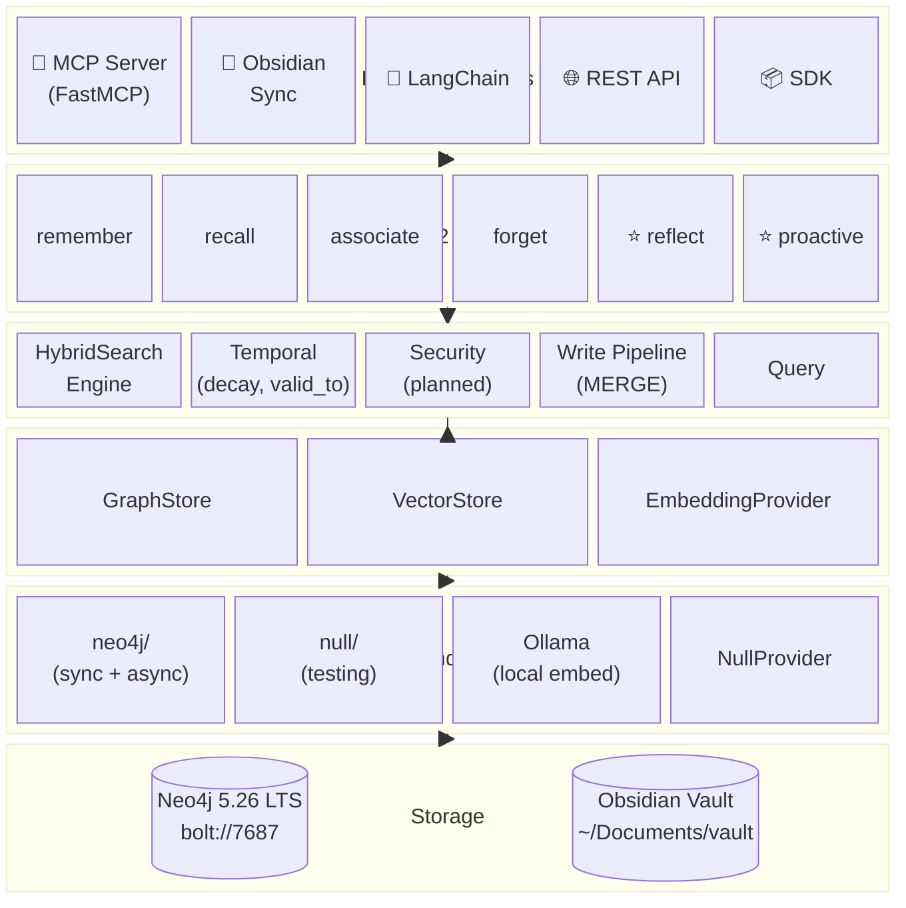
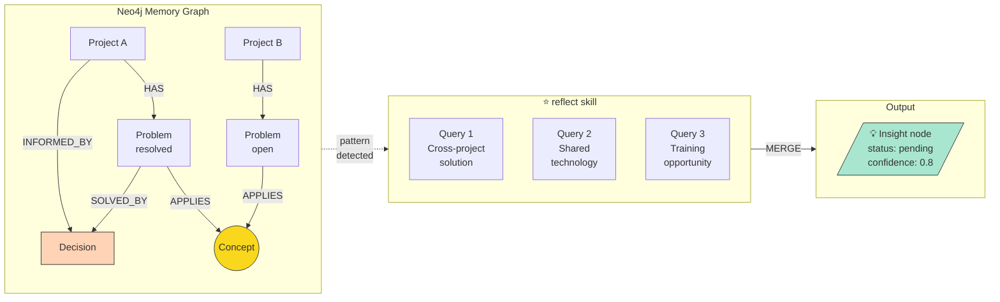
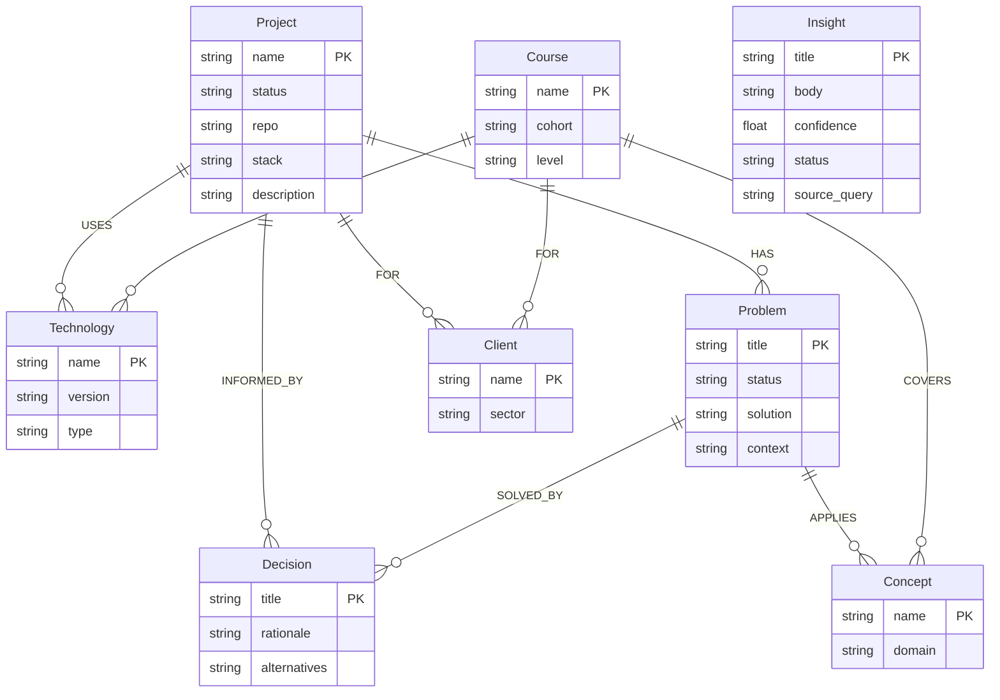
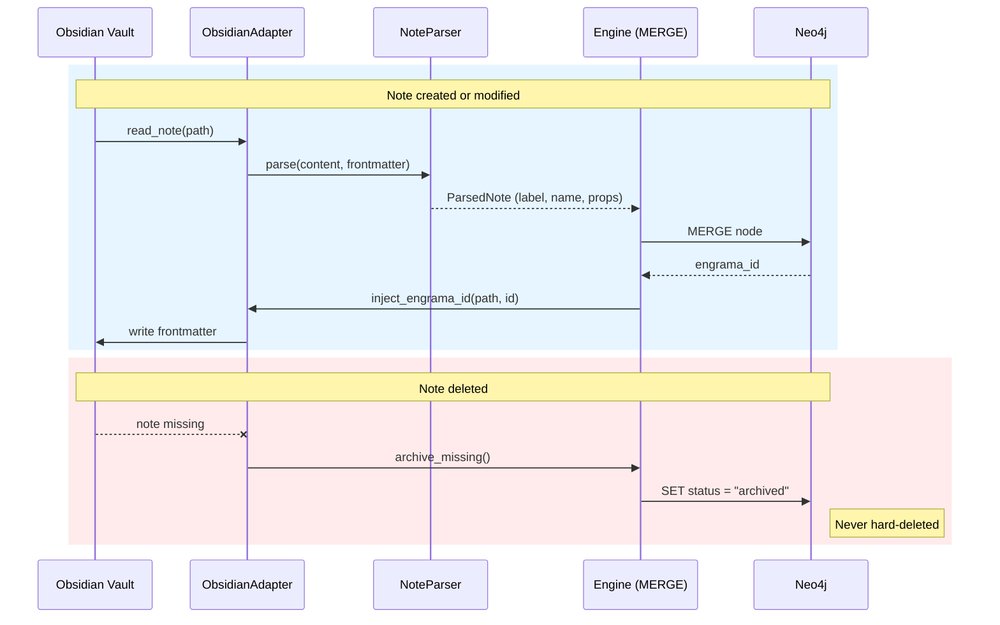

# Architecture

> Primary technical briefing document. Claude Code must read this before writing any code.

## Stack

| Component | Technology | Version | Reason |
|---|---|---|---|
| Database | Neo4j Community | 5.26.24 LTS | Free, local, supported until June 2028 |
| Language | Python | ≥ 3.11 | Agent ecosystem, FastMCP compatibility |
| Dependency mgmt | uv | latest | Modern standard, fast |
| MCP adapter | FastMCP + neo4j async | native | Protocol-based stores, zero Cypher in tools |
| Obsidian adapter | Local Obsidian MCP server | stdio | Document ↔ graph sync |
| Embeddings | Ollama + nomic-embed-text | latest | Local, private, no API keys (optional) |
| Async HTTP | httpx | ≥ 0.27 | Non-blocking embedding calls in MCP server |
| Container | Docker Desktop | latest | Reproducible infrastructure |
| CI/CD | GitHub Actions | — | Tests and PyPI publishing |
| Packaging | pyproject.toml | — | Installable as `pip install engrama` |

## What makes Engrama different

Engrama is not another MCP wrapper for Neo4j. It is a **cognitive framework**
combining two complementary layers:

- **Obsidian** — narrative memory (documents, reasoning, full context)
- **Neo4j** — relational memory (entities, relationships, patterns)

The `reflect` and `proactive` skills traverse the graph to surface connections
that neither layer could find alone. Example: a Problem in Project B shares a
Concept with a resolved Problem in Project A — Engrama detects this and
proposes the existing Decision as a solution candidate, without being asked.

## Layer diagram



## Data flow: reflect → Insight



## Graph schema



## Directory structure

```
engrama/
├── README.md
├── VISION.md
├── ARCHITECTURE.md
├── GRAPH-SCHEMA.md
├── ROADMAP.md
├── CONTRIBUTING.md
├── CHANGELOG.md
├── pyproject.toml
├── docker-compose.yml
├── .env.example
│
├── engrama/
│   ├── __init__.py
│   │
│   ├── core/
│   │   ├── client.py        # Neo4j driver, connection pool, health check
│   │   ├── engine.py        # write pipeline (MERGE+timestamps), query, fulltext
│   │   ├── protocols.py     # GraphStore, VectorStore, EmbeddingProvider (DDR-003)
│   │   ├── schema.py        # Python dataclasses for nodes and relationships
│   │   ├── search.py        # HybridSearchEngine — multi-signal scoring (DDR-003 C)
│   │   ├── temporal.py      # Confidence decay, temporal_score, days_since (DDR-003 D)
│   │   └── text.py          # Re-export of node_to_text (embeddings/text.py)
│   │
│   ├── backends/
│   │   ├── __init__.py      # create_stores(), create_async_store() factories
│   │   ├── null.py          # NullGraphStore, NullVectorStore (testing / zero-dep)
│   │   └── neo4j/
│   │       ├── backend.py   # Neo4jGraphStore (sync) — SDK/CLI via EngramaEngine
│   │       ├── async_store.py # Neo4jAsyncStore (async) — MCP server, all Cypher
│   │       └── vector.py    # Neo4jVectorStore — vector index operations
│   │
│   ├── embeddings/
│   │   ├── __init__.py      # create_provider() factory — reads .env
│   │   ├── null.py          # NullProvider (no embeddings, dimensions=0)
│   │   ├── ollama.py        # OllamaProvider — local embeddings via Ollama API
│   │   └── text.py          # node_to_text() — canonical text for embedding
│   │
│   ├── skills/
│   │   ├── remember.py      # MERGE entity + observation
│   │   ├── recall.py        # fulltext search + graph traversal
│   │   ├── associate.py     # create relationships between entities
│   │   ├── reflect.py       # ★ cross-entity pattern detection
│   │   ├── proactive.py     # ★ surfaces Insights without being asked
│   │   └── forget.py        # decay, archiving, TTL
│   │
│   ├── adapters/
│   │   ├── mcp/
│   │   │   └── server.py    # MCP server (FastMCP + async store) — zero Cypher
│   │   ├── obsidian/        # ★ Obsidian adapter — document ↔ graph sync
│   │   │   ├── adapter.py   # vault file I/O
│   │   │   ├── parser.py    # extracts entities from note frontmatter + content
│   │   │   └── sync.py      # bidirectional sync via engrama_id
│   │   └── sdk/             # Engrama Python SDK (context manager)
│   │
│   └── ingest/
│       ├── conversation.py  # extract entities from conversation transcripts
│       └── web.py           # URLs, RSS feeds
│                            # (document ingestion → adapters/obsidian/)
│
├── profiles/
│   ├── base.yaml             # Universal base (Project, Concept, Decision, ...)
│   ├── developer.yaml        # Standalone example profile
│   └── modules/
│       ├── hacking.yaml      # Domain module examples
│       ├── teaching.yaml     # (users create their own for any domain)
│       ├── photography.yaml
│       └── ai.yaml
│
├── scripts/
│   └── init-schema.cypher
│
├── examples/
│   ├── claude_desktop/
│   │   ├── config.json
│   │   └── system-prompt.md
│   └── langchain_agent/
│
└── tests/
    ├── conftest.py
    ├── test_core.py           # engine, client, schema
    ├── test_skills.py         # reflect, proactive
    ├── test_adapters.py       # MCP server integration
    ├── test_cli.py            # CLI commands
    ├── test_composable.py     # profile composition
    ├── test_embeddings.py     # Null, Ollama (mocked+live), text, factory
    ├── test_hybrid_search.py  # HybridSearchEngine sync + async
    ├── test_neo4j_store.py    # Neo4jAsyncStore integration
    ├── test_obsidian_sync.py  # vault ↔ graph sync
    ├── test_phase4_skills.py  # associate, forget
    ├── test_proactive.py      # proactivity triggers
    ├── test_protocols.py      # protocol conformance
    ├── test_sdk.py            # Python SDK
    ├── test_temporal.py       # confidence decay, valid_to, temporal queries
    └── test_vector_store.py   # vector index operations
```

## Obsidian integration

The vault is the **narrative layer**. Neo4j is the **relational layer**.
Neither replaces the other. The local Obsidian MCP server is a custom stdio
implementation that handles vault file I/O operations.

### Referential integrity via engrama_id

Every documented node (Project, Course) carries `engrama_id` in its note's
YAML frontmatter. `adapters/obsidian/sync.py` maintains the contract:



### Obsidian sync

All vault notes are candidates for sync.  The parser infers the node label
from frontmatter (`engrama_label:`) or folder structure.  Notes that cannot
be classified are skipped.  The `ObsidianAdapter` handles all file I/O
directly — no external MCP server dependency.

| Operation | Module | Purpose |
|---|---|---|
| Read note | `adapter.py` | Extract content + frontmatter |
| Search notes | `adapter.py` | Find related notes by text |
| List notes | `adapter.py` | Full vault scan |
| Inject engrama_id | `adapter.py` | Bidirectional sync identity |
| `vault_create_note` | proactive.py | write Insight notes back to vault |
| `vault_append_note` | proactive.py | add insight section to existing notes |

### frontmatter extensions in the local MCP server

The local Obsidian MCP server currently generates `date` and `tags` in frontmatter.
Engrama extends this by injecting `engrama_id` — making it a first-class frontmatter
citizen for bidirectional sync between notes and the Neo4j graph.

## The distinctive skills: reflect + proactive + ingest

`skills/reflect.py` runs **adaptive** cross-entity pattern detection. Before
executing any Cypher, it profiles the graph (counts labels with data) and only
runs patterns whose preconditions are met. Seven detection patterns:

1. **Cross-project solution** — Problems sharing Concepts with resolved Problems in other Projects
2. **Shared technology** — any two entities connected to the same Technology via USES/TEACHES/COMPOSED_OF
3. **Training opportunity** — Vulnerabilities or open Problems linked to Concepts that a Course covers
4. **Technique transfer** — Techniques used in 2+ Domains
5. **Concept clustering** — 3+ entities sharing a Concept
6. **Stale knowledge** — nodes >90 days old OR with confidence <0.3, still linked to active Projects or Courses
7. **Under-connected** — nodes with <2 relationships (enrichment candidates)

Results are written as `Insight` nodes with confidence scores scaled by
connection strength and entity count. Previously dismissed Insights are never
re-surfaced.

`skills/proactive.py` surfaces pending Insights to the agent and writes them
back to Obsidian via `vault_append_note`. The agent proposes — the human
approves. Insights are never acted upon automatically.

**Proactivity triggers** (module-level state in the MCP server):
- After 10+ `engrama_remember` calls since last reflect → `proactive_hint` returned
- `engrama_search` checks for pending Insights related to the query
- `engrama_reflect` resets the counter

**Ingestion** (`engrama_ingest`): reads a vault note, raw text, or conversation
transcript and returns the content with entity extraction guidance plus
deduplication hints (existing nodes in the graph). The agent then calls
`engrama_remember` for each extracted entity — agent-driven, not opaque.

## Protocol layer (DDR-003 Phase A)

All storage operations go through abstract protocols defined in
`core/protocols.py`: `GraphStore`, `VectorStore`, and `EmbeddingProvider`.
No adapter, skill, or tool writes Cypher directly — everything goes through
a backend implementation.

Two backend paths exist:

- **Sync** (`Neo4jGraphStore` in `backends/neo4j/backend.py`) — used by the SDK / CLI
  via `EngramaEngine`.  Wraps `EngramaClient` (sync `neo4j` driver).
- **Async** (`Neo4jAsyncStore` in `backends/neo4j/async_store.py`) — used by the MCP
  server (`server.py`).  Wraps `neo4j.AsyncDriver`.  Contains **all** Cypher for the
  MCP tools.  The MCP `server.py` itself contains zero Cypher strings.

Null implementations (`NullGraphStore`, `NullVectorStore`) exist for testing and
dry-run mode.  Future backends (e.g. NebulaGraph, pgvector) implement the same
protocols.

The `create_stores()` and `create_async_store()` factories in `backends/__init__.py`
read `GRAPH_BACKEND` / `VECTOR_BACKEND` from environment and return the appropriate
implementations.

## Embedding and hybrid search (DDR-003 Phase B + C)

Embedding providers implement `EmbeddingProvider` from `core/protocols.py`:

- **OllamaProvider** (`embeddings/ollama.py`) — local embeddings via Ollama API.
  Dual-mode: sync methods (`embed`, `embed_batch`, `health_check`) use stdlib
  `urllib`; async methods (`aembed`, `aembed_batch`, `ahealth_check`) use `httpx`.
  Default model: `nomic-embed-text` (768 dimensions).
- **NullProvider** (`embeddings/null.py`) — no-op, `dimensions=0`.  Used when
  `EMBEDDING_PROVIDER=none` (default).  Has both sync and async methods.

`node_to_text()` in `embeddings/text.py` builds the text string that gets embedded
(re-exported from `core/text.py`).

**Embed-on-write**: when an embedding provider is active, `engrama_remember` and
`engrama_sync_note` automatically embed each node after merging.  The embedding is
stored as a `n.embedding` property and the node gets an `:Embedded` secondary label.

**Vector index**: a single Neo4j vector index on `(:Embedded)` covers all node types
via the shared `:Embedded` label.  Created by `init-schema.cypher` or programmatically
via `Neo4jVectorStore.ensure_index()`.

**Hybrid search** (`core/search.py`): `HybridSearchEngine` fuses fulltext + vector
+ graph-boost + temporal signals.  Both sync (`search()`) and async (`asearch()`)
methods are available.  Scoring formula:

    final = α × vector + (1-α) × fulltext + β × graph_boost + γ × temporal

When `EMBEDDING_PROVIDER=none`, α is forced to 0 — pure fulltext with optional
graph-boost.  Graceful degradation: if Ollama is down, the vector branch is
skipped silently.

The MCP server uses `asearch()` with the async store as both graph and vector
backend.  The CLI/SDK uses `search()` with sync stores.

## Temporal reasoning (DDR-003 Phase D)

Every node carries temporal metadata enabling confidence decay, fact
supersession, and time-travel queries.

**Temporal fields on all nodes:**

- `valid_from` (datetime) — when the fact became true. Auto-set on creation.
- `valid_to` (datetime) — when the fact was superseded. `null` = still true.
- `confidence` (float, 0.0–1.0) — decays over time. Defaults to 1.0.
- `decayed_at` (datetime) — last time confidence was decayed.
- `created_at`, `updated_at` — system timestamps (auto-managed).

**Confidence decay** applies exponential decay:
`new_confidence = confidence × exp(-decay_rate × days_since_update)`.
Run via `engrama decay` CLI or programmatically via `decay_confidence()`.
Nodes with confidence below 0.05, archived status, or updated today are
excluded.

**Supersession (`valid_to`)**: when `valid_to` is set on a node, confidence
is automatically halved (superseded facts are less trustworthy). Updating a
superseded node clears `valid_to` (revival) and logs a conflict warning.

**Temporal queries** (`query_at_date`): returns nodes where
`valid_from <= date AND (valid_to IS NULL OR valid_to >= date)`.
Useful for "what technologies were we using in January?".

**Temporal scoring in hybrid search**: the `γ × temporal` term in the scoring
formula combines confidence with recency.
`temporal_score = confidence × 2^(-days / half_life)`.
Default γ=0.1 and half_life=30 days.

## MCP adapter

Native MCP server built with FastMCP and the official `neo4j` async driver.
All Cypher lives in `Neo4jAsyncStore` — the MCP tools handle orchestration,
validation, vault I/O, and response formatting only.

Exposes eleven tools:
- `engrama_search` — hybrid search (vector + fulltext + graph boost) across the memory graph
- `engrama_remember` — create or update a node (always MERGE)
- `engrama_relate` — create a relationship (handles title-keyed nodes)
- `engrama_context` — retrieve the neighbourhood of a node up to N hops
- `engrama_sync_note` — sync a single Obsidian note to the graph
- `engrama_sync_vault` — full vault scan, reconcile all notes
- `engrama_ingest` — read content and return extraction guidance
- `engrama_reflect` — adaptive cross-entity pattern detection → Insight nodes
- `engrama_surface_insights` — read pending Insights for agent presentation
- `engrama_approve_insight` — human approves or dismisses an Insight
- `engrama_write_insight_to_vault` — append approved Insight to Obsidian note

## Profile system

Profiles are the single source of truth for the graph schema.  There are two
modes: standalone profiles and composable modules.

**Standalone** (one YAML, complete schema):
```bash
uv run engrama init --profile developer
```

**Composable** (base + domain modules, recommended for multi-role users):
```bash
uv run engrama init --profile base --modules hacking teaching photography
```

The base profile (`profiles/base.yaml`) defines universal nodes: Project,
Concept, Decision, Problem, Technology, Person.  Domain modules in
`profiles/modules/` add domain-specific nodes and can reference base labels
in their relations.  The merge engine unions properties, deduplicates
relations, and validates all endpoints.

Users can create modules for **any** domain — the included modules are
examples, not a fixed set.  The onboard skill generates custom modules
through a conversational interview.

## Configuration reference (.env)

| Variable | Default | Description |
|---|---|---|
| `NEO4J_URI` | `bolt://localhost:7687` | Neo4j connection URI |
| `NEO4J_USERNAME` | `neo4j` | Neo4j username |
| `NEO4J_PASSWORD` | — | Neo4j password (required) |
| `NEO4J_DATABASE` | `neo4j` | Neo4j database name |
| `ENGRAMA_PROFILE` | `developer` | Profile name for schema generation |
| `VAULT_PATH` | `~/Documents/vault` | Obsidian vault root path |
| `GRAPH_BACKEND` | `neo4j` | Graph store backend (`neo4j` or `none`) |
| `VECTOR_BACKEND` | `none` | Vector store backend (`neo4j` or `none`) |
| `EMBEDDING_PROVIDER` | `none` | Embedding provider (`ollama` or `none`) |
| `EMBEDDING_MODEL` | `nomic-embed-text` | Ollama model name |
| `EMBEDDING_DIMENSIONS` | `768` | Embedding vector size |
| `OLLAMA_URL` | `http://localhost:11434` | Ollama API endpoint |
| `HYBRID_ALPHA` | `0.6` | Vector vs fulltext weight (0=fulltext, 1=vector) |
| `HYBRID_GRAPH_BETA` | `0.15` | Graph topology boost weight |

## Implementation rules

1. **Always `MERGE`, never bare `CREATE`** — prevents duplicates
2. **Fulltext index is mandatory** — `memory_search` across all text properties
3. **Timestamps everywhere** — `created_at` and `updated_at` on every node
4. **Embeddings are optional** — graph structure is primary; local embeddings (Ollama) enhance search when enabled
5. **Integration tests against real Neo4j** — no mocks for the data layer
6. **Cypher parameters always** — never string-format queries
7. **server.py contains zero Cypher** — all queries live in backends/

## Related repositories

- `scops/engrama` — this framework

> **Note:** An intermediate `mcp-neo4j` layer was originally planned but was
> dropped in favour of a native MCP server.  The async Neo4j driver gives full
> control over MERGE logic, parameter handling, and key selection (name vs title)
> without an extra dependency.
