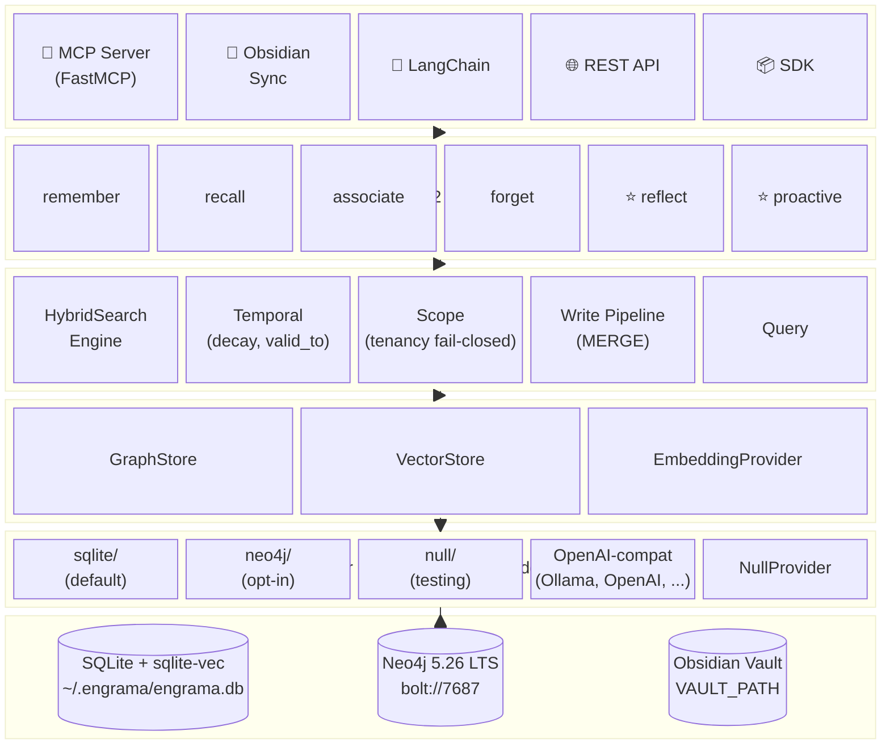
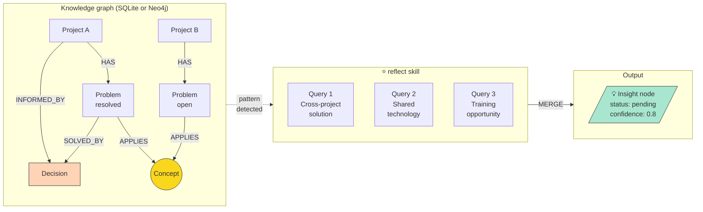
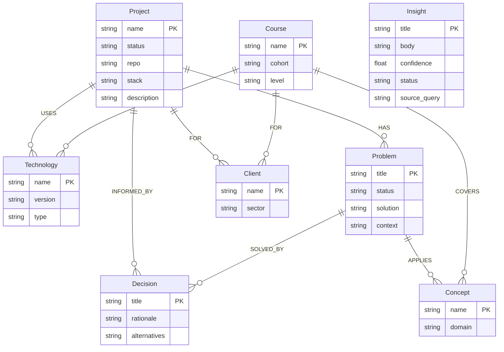
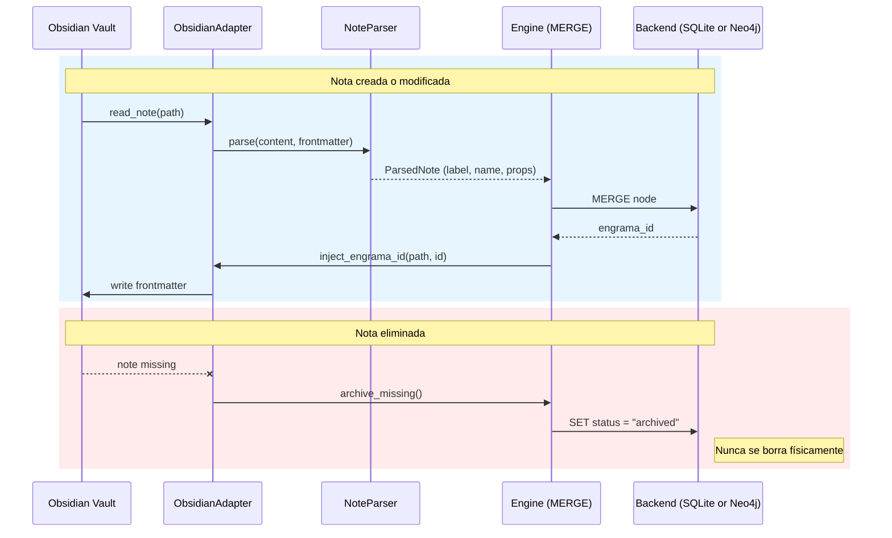

# Arquitectura

> Documento técnico de referencia principal. Claude Code (y cualquier otro
> agente de código) debe leer esto antes de escribir una sola línea.

## Stack

| Componente | Tecnología | Versión | Razón |
|---|---|---|---|
| Backend por defecto | SQLite + `sqlite-vec` | 3.40+ / 0.1+ | Almacenamiento portátil sin dependencias (DDR-004) |
| Backend opcional | Neo4j Community | 5.26.24 LTS | Producción multiproceso, índices vectoriales grandes |
| Lenguaje | Python | ≥ 3.11 | Ecosistema de agentes, compatibilidad con FastMCP |
| Gestión de deps. | uv | latest | Estándar moderno, rápido |
| Adaptador MCP | FastMCP + async stores | nativo | Stores basados en protocolos, cero Cypher en herramientas |
| Adaptador Obsidian | stdio local | — | Sincronización documento ↔ grafo |
| Embeddings | HTTP OpenAI-compat | — | Ollama, OpenAI, LM Studio, vLLM, llama.cpp, Jina (DDR-004) |
| HTTP asíncrono | httpx | ≥ 0.27 | Llamadas de embedding no bloqueantes en el servidor MCP |
| Contenedor (solo Neo4j) | Docker Desktop | latest | Infraestructura Neo4j reproducible |
| CI/CD | GitHub Actions | — | Tests y publicación en PyPI |
| Empaquetado | pyproject.toml | — | Publicado en PyPI como `engrama`; `pip install engrama` o `pip install "engrama[neo4j]"` |

## Qué hace diferente a Engrama

Engrama no es otro wrapper MCP para una sola base de datos. Es un
**framework cognitivo** que combina dos capas de memoria complementarias:

- **Vault de Obsidian** — memoria narrativa (documentos, razonamiento,
  contexto completo).
- **Grafo de conocimiento** — memoria relacional (entidades, relaciones,
  patrones). Respaldado por SQLite por defecto, o Neo4j cuando la escala
  lo requiere. Modelo de datos idéntico en ambos.

Los skills `reflect` y `proactive` recorren el grafo para descubrir
conexiones que ninguna de las dos capas podría encontrar por separado.
Ejemplo: un Problema en el Proyecto B comparte un Concepto con un
Problema resuelto en el Proyecto A — Engrama lo detecta y propone la
Decisión existente como candidata a solución, sin que nadie se lo pida.

## Diagrama de capas



La factoría en `engrama/backends/__init__.py` lee `GRAPH_BACKEND` y
devuelve la implementación correspondiente. Los skills, adaptadores y el
motor solo hablan con los protocolos — no saben qué backend hay debajo.
Consulta [DDR-004](ddr-004.md) para la justificación y [backends.md](backends.md)
para la guía de elección orientada al usuario.

## Flujo de datos: reflect → Insight



El skill reflect emite nodos Insight idénticos independientemente del
backend. La detección de patrones en Neo4j usa Cypher; en SQLite cada
patrón es una consulta SQL traducida a mano que devuelve las mismas
filas. La suite de contratos en `tests/contracts/` garantiza la
equivalencia.

## Esquema del grafo



El esquema se define en `profiles/*.yaml` y se aplica al backend que
esté activo. SQLite codifica las etiquetas en una columna `label` de la
tabla `nodes`; Neo4j usa etiquetas de nodo nativas. Desde el punto de
vista de la aplicación, esto es transparente.

## Estructura de directorios

```
engrama/
├── README.md
├── README_ES.md
├── vision.md
├── architecture.md
├── backends.md              # ★ NUEVO (DDR-004) — guía de elección de backend
├── graph-schema.md
├── roadmap.md
├── contributing.md
├── changelog.md
├── ddr-001.md … ddr-004.md
├── pyproject.toml
├── docker-compose.yml       # Solo Neo4j — no necesario para SQLite por defecto
├── .env.example
│
├── engrama/
│   ├── __init__.py
│   │
│   ├── core/
│   │   ├── client.py        # Wrapper del driver Neo4j (síncrono)
│   │   ├── engine.py        # Pipeline de escritura síncrono (MERGE+timestamps)
│   │   ├── protocols.py     # GraphStore / VectorStore / EmbeddingProvider
│   │   ├── schema.py        # Dataclasses Python para nodos y relaciones
│   │   ├── search.py        # HybridSearchEngine — scoring multi-señal
│   │   ├── temporal.py      # Confidence decay, days_since, temporal_score
│   │   └── text.py          # Re-export de node_to_text
│   │
│   ├── backends/            # ★ DDR-004: backends enchufables
│   │   ├── __init__.py      # Factoría create_stores() / create_async_stores()
│   │   ├── null.py          # NullGraphStore / NullVectorStore (testing)
│   │   ├── sqlite/          # ★ NUEVO — backend por defecto
│   │   │   ├── store.py     # SqliteGraphStore (síncrono)
│   │   │   ├── async_store.py # SqliteAsyncStore — mismo contrato que Neo4jAsyncStore
│   │   │   ├── vector.py    # SqliteVecStore — virtual table de sqlite-vec
│   │   │   └── schema.sql   # Se aplica automáticamente en la primera conexión
│   │   └── neo4j/           # Opt-in vía `uv sync --extra neo4j`
│   │       ├── backend.py   # Neo4jGraphStore (síncrono) — SDK / CLI
│   │       ├── async_store.py # Neo4jAsyncStore (asíncrono) — servidor MCP
│   │       └── vector.py    # Neo4jVectorStore — operaciones de índice vectorial
│   │
│   ├── embeddings/
│   │   ├── __init__.py        # Factoría create_provider()
│   │   ├── null.py            # NullProvider (sin embeddings)
│   │   ├── ollama.py          # Wrapper legacy de conveniencia
│   │   ├── openai_compat.py   # ★ NUEVO — OpenAI / Ollama / LM Studio / vLLM / Jina (DDR-004)
│   │   └── text.py            # node_to_text() — texto canónico para embedding
│   │
│   ├── skills/
│   │   ├── remember.py      # MERGE entidad + observación
│   │   ├── recall.py        # Búsqueda fulltext + recorrido del grafo
│   │   ├── associate.py     # Crear relaciones entre entidades
│   │   ├── reflect.py       # ★ Detección de patrones cross-entidad
│   │   ├── proactive.py     # ★ Presenta Insights sin que se lo pidan
│   │   └── forget.py        # Decaimiento, archivado, TTL
│   │
│   ├── adapters/
│   │   ├── mcp/             # Servidor FastMCP (cero Cypher en los handlers)
│   │   ├── obsidian/        # ★ Sincronización bidireccional vault ↔ grafo (DDR-002)
│   │   └── sdk/             # SDK Python de Engrama (context manager)
│   │
│   └── ingest/
│       ├── conversation.py
│       └── web.py
│
├── profiles/
│   ├── base.yaml            # Base universal
│   ├── developer.yaml       # Ejemplo standalone
│   └── modules/             # Módulos de dominio componibles
│
├── scripts/
│   └── init-schema.cypher   # Solo Neo4j; SQLite usa backends/sqlite/schema.sql
│
├── examples/
│   ├── claude_desktop/
│   └── langchain_agent/
│
└── tests/
    ├── conftest.py
    ├── contracts/           # ★ Parametrizados sobre ambos backends
    │   ├── test_graphstore_contract.py        # Stores síncronos
    │   └── test_async_graphstore_contract.py  # Stores asíncronos (DDR-004)
    ├── backends/
    │   ├── test_sqlite.py
    │   ├── test_sqlite_async.py
    │   └── test_sqlite_vector.py
    ├── test_core.py
    ├── test_skills.py
    ├── test_adapters.py
    ├── test_obsidian_sync.py
    ├── test_phase4_skills.py
    ├── test_proactive.py
    ├── test_protocols.py
    ├── test_sdk.py
    ├── test_cli.py
    ├── test_composable.py
    ├── test_embeddings.py
    ├── test_openai_compat_embedder.py  # ★ NUEVO
    ├── test_hybrid_search.py
    ├── test_neo4j_store.py             # Integración async con Neo4j
    ├── test_temporal.py
    └── test_vector_store.py
```

## Capa de protocolos y backends

Todas las operaciones de almacenamiento pasan por protocolos abstractos
definidos en `core/protocols.py`: `GraphStore`, `VectorStore` y
`EmbeddingProvider`. Ningún adaptador, skill ni herramienta escribe
Cypher o SQL directamente — todo pasa por una implementación del
backend.

Hay **dos pares** de implementaciones de backend:

### Stores síncronos (usados por el SDK y la CLI a través de `EngramaEngine`)

- `SqliteGraphStore` (`backends/sqlite/store.py`) — por defecto. Python
  puro sobre `sqlite3`. El `SqliteVecStore` comparte la misma conexión,
  así que los vectores viven en el mismo archivo `.db`.
- `Neo4jGraphStore` (`backends/neo4j/backend.py`) — envuelve
  `EngramaClient` (driver `neo4j` síncrono).

### Stores asíncronos (usados por el servidor MCP)

- `SqliteAsyncStore` (`backends/sqlite/async_store.py`) — envuelve el
  store SQLite síncrono y traduce la forma de retorno de cada método
  para que los handlers MCP reciban la misma estructura de diccionario
  independientemente del backend.
- `Neo4jAsyncStore` (`backends/neo4j/async_store.py`) — envuelve
  `neo4j.AsyncDriver`. Contiene **todo** el Cypher de las herramientas
  MCP. El propio `server.py` no contiene ni una cadena Cypher.

`NullGraphStore` y `NullVectorStore` existen para testing y modo
dry-run. Se pueden añadir nuevos backends (NebulaGraph, ArcadeDB,
pgvector, Chroma, LEANN, ...) implementando los mismos protocolos.

Las factorías `create_stores()` y `create_async_stores()` en
`backends/__init__.py` leen `GRAPH_BACKEND` / `VECTOR_BACKEND` del
entorno (o de un dict de configuración explícito) y devuelven las
implementaciones adecuadas.

### Las suites de contratos

Dos suites parametrizadas de pytest residen en `tests/contracts/`:

- `test_graphstore_contract.py` — ejecuta todos los tests de
  comportamiento contra ambos stores síncronos.
- `test_async_graphstore_contract.py` — ejecuta todos los tests de
  comportamiento contra ambos stores asíncronos.

Los tests de Neo4j se saltan si `NEO4J_PASSWORD` no está configurado,
así que la suite solo-SQLite (76 tests) pasa en un checkout limpio sin
`.env`. Juntas detectaron tres bugs de deriva que se descubrieron y
corrigieron durante la implementación de DDR-004; las suites existen
para asegurar que no reaparezcan.

## Embeddings (DDR-003 Fase B + DDR-004)

`EmbeddingProvider` está implementado por:

- `OpenAICompatibleProvider` (`embeddings/openai_compat.py`) —
  habla el formato HTTP `/v1/embeddings` de OpenAI. Funciona con OpenAI
  directamente, Ollama (`OPENAI_BASE_URL=http://localhost:11434/v1`),
  LM Studio, vLLM, llama.cpp, Jina, o cualquier otro servicio
  compatible. Métodos síncronos (`embed`, `embed_batch`) y asíncronos
  (`aembed`, `aembed_batch`), ambos usan `httpx`.
- `OllamaProvider` (`embeddings/ollama.py`) — wrapper legacy de
  conveniencia. Usa el endpoint nativo `/api/embeddings` de Ollama.
  Se mantiene por compatibilidad con archivos `.env` existentes.
- `NullProvider` (`embeddings/null.py`) — no-op, `dimensions=0`. Se
  usa cuando `EMBEDDING_PROVIDER=none` (por defecto). Tiene métodos
  síncronos y asíncronos.

`node_to_text()` en `embeddings/text.py` construye la cadena de texto
que se embebe.

**Embed-on-write**: cuando hay un proveedor de embeddings activo,
`engrama_remember` y `engrama_sync_note` embeben automáticamente cada
nodo tras el merge. El vector se almacena:

- **SQLite:** en la virtual table `vec0` `node_embeddings` (mismo
  archivo `.db`).
- **Neo4j:** como propiedad `n.embedding`; los nodos reciben una
  etiqueta secundaria `:Embedded` para que el índice vectorial cubra
  todos los tipos de nodo.

## Búsqueda híbrida (DDR-003 Fase C; ranking renovado en spec 002)

`HybridSearchEngine` (`core/search.py`) fusiona la relevancia fulltext +
vectorial con señales temporal y de confianza. Dispone de métodos síncronos
(`search()`) y asíncronos (`asearch()`).

Desde spec 002 la base de relevancia por defecto es **Reciprocal Rank
Fusion** (`fusion_mode="rrf"`), que combina ambos canales por *rango* y no
por score crudo — así la respuesta correcta emerge sin importar cuánto
difieran las escalas de score de cada canal. Fórmula de puntuación (modo rrf):

    final = rrf_score + β × graph_distance + γ × temporal + δ × trust

- `rrf_score`: la base de relevancia fusionada por rango y normalizada a
  [0,1] (`1/(k + rango)` sumado sobre los canales en que aparece el nodo,
  `k` = `ENGRAMA_RRF_K`, por defecto 60).
- `graph_distance`: señal de grafo por **distancia de nodo** (`graph_rerank`,
  activa por defecto) calculada sobre la ventana de candidatos fusionados —
  *cohesión* del result-set (un candidato cercano a otros candidatos fuertes
  sube, con decaimiento por salto) más, cuando la query resuelve a un nodo
  *ancla* dentro de los resultados, un boost por cercanía a él. Reemplaza el
  viejo `graph_boost` por grado y está filtrada por scope (solo cuentan
  vecinos del mismo tenant). Acotada por `ENGRAMA_GRAPH_HOPS` /
  `ENGRAMA_FANOUT_CAP`.

**Mezcla lineal legacy** — define `ENGRAMA_RANKING_LEGACY=1` (o
`fusion_mode="linear"`) para volver a la fórmula previa a spec 002:

    final = α × vector + (1-α) × fulltext + β × graph_boost + γ × temporal + δ × trust

Cuando `EMBEDDING_PROVIDER=none` el canal vectorial queda vacío — RRF
degrada al orden del canal fulltext (el modo lineal fuerza α a 0).
Degradación elegante: si el servicio de embeddings no responde, la rama
vectorial se omite silenciosamente y la señal `degraded`/`mode` lo registra.

Tanto los stores síncronos como los asíncronos exponen `search_similar`
devolviendo una forma uniforme `{node_id, label, name, score, summary,
tags, confidence, updated_at}` para que el scorer pueda rellenar campos
de enriquecimiento sin una segunda ida al backend — una regresión
descubierta durante las pruebas de DDR-004 (ver [DDR-004](ddr-004.md)
"Riesgos").

## Razonamiento temporal (DDR-003 Fase D)

Cada nodo lleva metadatos temporales que habilitan el decaimiento de
confianza, la supersesión de hechos y las consultas de viaje en el
tiempo:

- `valid_from` (datetime) — cuándo el hecho pasó a ser verdadero.
  Se establece automáticamente en la creación.
- `valid_to` (datetime) — cuándo el hecho fue supersedido. `null` =
  sigue siendo verdadero.
- `confidence` (float, 0.0–1.0) — decae con el tiempo. Por defecto
  1.0.
- `decayed_at` (datetime) — último pase de decaimiento.
- `created_at`, `updated_at` — marcas temporales del sistema
  (gestionadas automáticamente).

**Decaimiento de confianza** (`engrama decay`): decaimiento exponencial
`new_conf = conf × exp(-rate × days_since_update)`.

**Supersesión (`valid_to`)**: establecerlo reduce automáticamente la
confianza a la mitad. Actualizar un nodo supersedido limpia `valid_to`
(revivir) y registra una advertencia de conflicto.

**Consultas temporales** (`query_at_date`): devuelve nodos donde
`valid_from <= date AND (valid_to IS NULL OR valid_to >= date)`.

**Puntuación temporal en la búsqueda híbrida**: el término `γ × temporal`
combina confianza con recencia.
`temporal_score = confidence × 2^(-days / half_life)`.
Por defecto γ=0.1 y half_life=30 días.

## Identidad y tenancy (Spec 001)

Cada nodo y relación pertenece a una identidad `(org_id, user_id)`, y las
lecturas son **fail-closed**: un scope `None`, vacío o resuelto a medias no
matchea nada en vez de ensancharse a "verlo todo". Engrama **no** autentica
— consume una identidad aseverada upstream.

- **Helpers de scope** (`core/scope.py`): `scope_filter_cypher` /
  `scope_filter_sql` construyen el fragmento `WHERE` que cada lectura añade.
  Devuelven `(false)` / `(1 = 0)` para un scope incompleto — el único punto
  de estrangulamiento que hace el aislamiento fail-closed.
- **Resolución por petición** (límite MCP): el servidor lee
  `X-Engrama-Org-Id` / `X-Engrama-User-Id` de la petición y fija el scope de
  la llamada. Exactamente una cabecera presente → `ScopeUnresolved` (las
  lecturas devuelven cero resultados; las escrituras se rechazan). Sin
  cabeceras → la **identidad standalone** del proceso, calculada una vez al
  arranque (una instalación de un solo proceso no necesita configuración).
- **Guard de escritura** (`EngramaEngine`): `merge_node` / `merge_relation`
  lanzan ante una llamada SDK directa sin scope completo, de modo que un
  bypass por SDK no puede escribir filas sin scope.
- **Guard de CI** (`scripts/check_scoped_queries.py`): un escaneo AST rompe el
  build ante cualquier query de backend nueva que ni pase por el helper de
  scope ni lleve un `# scope-exempt: <razón>` explícito. Integrado en CI como
  paso bloqueante.
- **Migración**: `engrama migrate tenancy --owner-sub <sub> --apply` sella la
  propiedad sobre un grafo pre-0.13 cuyas filas son, de otro modo, invisibles
  bajo lecturas fail-closed.

Ver [graph-schema.es.md](graph-schema.es.md#campos-de-identidad-todos-los-nodos-y-relaciones)
para los campos almacenados y [security.es.md](security.es.md#aislamiento-por-tenant-multi-tenant)
para el modelo de aislamiento de cara al operador y las herramientas
admin/cross-tenant.

## Integración con Obsidian (DDR-002)

El vault es la **capa narrativa**. El grafo es la **capa relacional**.
Ninguno sustituye al otro.

### Integridad referencial vía `engrama_id`

Cada nodo documentado lleva `engrama_id` en el frontmatter YAML de su
nota. `adapters/obsidian/sync.py` mantiene el contrato:



### Sincronización bidireccional

DDR-002 establece que cada relación se replica en el mapa `relations`
del frontmatter de la nota origen. Combinado con DDR-004 (almacenamiento
portátil), esto significa que un vault de Obsidian es una **copia de
seguridad portátil de todo el grafo**: una instalación SQLite nueva
apuntando al mismo vault reconstruye el grafo completo ejecutando
`engrama_sync_vault`.

| Operación | Módulo | Propósito |
|---|---|---|
| Leer nota | `adapter.py` | Extraer contenido + frontmatter |
| Buscar notas | `adapter.py` | Encontrar notas relacionadas por texto |
| Listar notas | `adapter.py` | Escaneo completo del vault |
| Inyectar engrama_id | `adapter.py` | Identidad de sincronización bidireccional |
| `vault_create_note` | `proactive.py` | Escribir notas de Insight de vuelta al vault |
| `vault_append_note` | `proactive.py` | Añadir sección de insight a notas existentes |

## Los skills distintivos: reflect + proactive + ingest

`skills/reflect.py` ejecuta detección de patrones cross-entidad
**adaptativa**. Antes de ejecutar cualquier patrón, perfila el grafo
(cuenta etiquetas con datos) y solo ejecuta patrones cuyas
precondiciones se cumplen. Siete patrones de detección:

1. **Solución cross-proyecto** — Problemas que comparten Conceptos con
   Problemas resueltos en otros Proyectos.
2. **Tecnología compartida** — cualesquiera dos entidades conectadas a
   la misma Tecnología vía USES/TEACHES/COMPOSED_OF.
3. **Oportunidad de formación** — Vulnerabilidades o Problemas abiertos
   vinculados a Conceptos que un Curso cubre.
4. **Transferencia de técnica** — Técnicas usadas en 2+ Dominios.
5. **Agrupación de conceptos** — 3+ entidades que comparten un Concepto.
6. **Conocimiento obsoleto** — nodos con >90 días de antigüedad O con
   confianza <0.3, aún vinculados a Proyectos o Cursos activos.
7. **Infraconectados** — nodos con <2 relaciones.

Los resultados se escriben como nodos `Insight` con confianza escalada
por la fuerza de conexión y el recuento de entidades. **Los Insights
previamente descartados Y aprobados nunca se resurgen** — la ejecución
de reflect filtra contra `dismissed | approved` para que volver a
ejecutar reflect no deshaga la revisión humana (regresión detectada y
corregida durante las pruebas de DDR-004).

`skills/proactive.py` presenta los Insights pendientes al agente y los
escribe de vuelta en Obsidian vía `vault_append_note`. El agente propone
— el humano aprueba. Los Insights nunca se ejecutan automáticamente.

**Disparadores de proactividad** (estado a nivel de módulo en el servidor
MCP):
- Tras 10+ llamadas a `engrama_remember` desde el último reflect →
  se devuelve `proactive_hint`.
- `engrama_search` comprueba si hay Insights pendientes relacionados
  con la consulta.
- `engrama_reflect` reinicia el contador.

**Ingesta** (`engrama_ingest`): lee una nota del vault, texto en crudo o
transcripción de conversación y devuelve el contenido con guía de
extracción de entidades más pistas de deduplicación (nodos existentes en
el grafo). El agente entonces llama a `engrama_remember` por cada
entidad extraída — dirigido por el agente, no opaco.

## Adaptador MCP

Servidor MCP nativo construido con FastMCP y el async store
correspondiente. Toda la lógica de almacenamiento reside en
`*AsyncStore`; los handlers de herramientas MCP se encargan solo de
orquestación, validación, E/S del vault y formateo de respuestas.

Catorce herramientas:

- `engrama_status` — introspección de solo lectura: ruta del vault,
  backend, embedder, modo de búsqueda, versión y `admin_tools` (las
  herramientas no aisladas por tenant, una pista para un gateway
  multi-tenant). Los agentes deben llamar a esto al inicio de sesión cuando
  Engrama coexiste con otros MCP capaces de acceder a Obsidian, para poder
  desambiguar a qué servidor se refiere "el vault" antes de cualquier
  sincronización.
- `engrama_search` — búsqueda híbrida en el grafo de memoria
- `engrama_remember` — crear o actualizar un nodo (siempre MERGE)
- `engrama_relate` — crear una relación (gestiona nodos con clave title)
- `engrama_context` — recuperar el vecindario de un nodo hasta N saltos
- `engrama_sync_note` — sincronizar una nota de Obsidian con el grafo;
  acepta `dry_run=true` para previsualizar el impacto sin escribir
- `engrama_sync_vault` — escaneo completo del vault, reconciliar todas
  las notas; acepta `dry_run=true` para proyectar recuentos de
  creación/actualización y listar los archivos que recibirían una
  inyección de `engrama_id`
- `engrama_ingest` — leer contenido y devolver guía de extracción
- `engrama_reindex` — detectar / clasificar / re-embeber nodos sin su
  vector (el embedder estaba caído al escribir); el escaneo está acotado al
  tenant llamante
- `engrama_reflect` — detección adaptativa de patrones cross-entidad →
  nodos Insight
- `engrama_surface_insights` — leer Insights pendientes para
  presentación al agente
- `engrama_approve_insight` — el humano aprueba o descarta un Insight
- `engrama_write_insight_to_vault` — añadir Insight aprobado a una nota
  de Obsidian
- `engrama_gdpr_forget` — borrar permanentemente la memoria del propio
  llamante (derecho de supresión RGPD); `mode='dry-run'` previsualiza,
  `mode='apply'` elimina

### Forma de respuesta de `engrama_status`

Contrato JSON estable. Los campos están ausentes (en lugar de `null`)
cuando el subsistema correspondiente está desactivado, de modo que un
agente puede hacer `if "path" in payload["vault"]:` de forma fiable.

```json
{
  "version": "0.15.0",
  "backend": {
    "name": "sqlite",
    "ok": true,
    "node_count": 1234
  },
  "vault": {
    "configured": true,
    "path": "/abs/path/to/engrama/vault",
    "note_count": 87
  },
  "embedder": {
    "configured": true,
    "provider": "ollama",
    "model": "nomic-embed-text",
    "dimensions": 768
  },
  "search": {
    "mode": "hybrid",
    "degraded": false,
    "reason": ""
  },
  "admin_tools": [
    {"name": "engrama_status",  "reason": "conteos a nivel de deployment; sin aislamiento por tenant"},
    {"name": "engrama_reindex", "reason": "datos acotados por tenant, pero re-embed masivo de carácter admin"}
  ]
}
```

`backend.name` está normalizado — los async stores subyacentes reportan
`sqlite-async` / `neo4j-async`, pero la herramienta elimina el sufijo
`-async` ya que los agentes razonan sobre qué base de datos está
ejecutándose, no sobre la forma del SDK. `search.degraded` siempre es
`false` en las llamadas de status (la degradación se detecta durante
`engrama_search`); usa este campo para predecir qué *intentaría* la
próxima búsqueda.

El CLI del servidor MCP acepta un flag `--backend` (`sqlite` o `neo4j`)
más overrides por backend (`--db-path`, `--neo4j-uri`,
`--neo4j-password`, `--vault-path`). Los valores por defecto se toman
del entorno.

## Sistema de perfiles

Los perfiles son la fuente única de verdad para el esquema del grafo.
Hay dos modos: perfiles standalone y módulos componibles.

**Standalone** (un YAML, esquema completo):
```bash
uv run engrama init --profile developer
```

**Componible** (base + módulos de dominio, recomendado para usuarios
multi-rol):
```bash
uv run engrama init --profile base --modules hacking teaching photography
```

El perfil base (`profiles/base.yaml`) define nodos universales:
Project, Concept, Decision, Problem, Technology, Person. Los módulos
de dominio en `profiles/modules/` añaden nodos específicos del dominio
y pueden referenciar etiquetas base en sus relaciones. El motor de merge
une propiedades, deduplica relaciones y valida todos los endpoints.

Los usuarios pueden crear módulos para **cualquier** dominio — los
módulos incluidos son ejemplos, no un conjunto fijo. El skill onboard
genera módulos personalizados mediante una entrevista conversacional.

## Referencia de configuración (`.env`)

| Variable | Por defecto | Descripción |
|---|---|---|
| `GRAPH_BACKEND` | `sqlite` | `sqlite`, `neo4j` o `null` |
| `VECTOR_BACKEND` | coincide con graph | `sqlite-vec`, `neo4j` o `none` (automático si ausente) |
| `ENGRAMA_DB_PATH` | `~/.engrama/engrama.db` | Archivo de base de datos SQLite |
| `NEO4J_URI` | `bolt://localhost:7687` | URI de conexión a Neo4j |
| `NEO4J_USERNAME` | `neo4j` | Nombre de usuario de Neo4j |
| `NEO4J_PASSWORD` | — | Contraseña de Neo4j (requerida cuando `GRAPH_BACKEND=neo4j`) |
| `NEO4J_DATABASE` | `neo4j` | Nombre de la base de datos Neo4j |
| `VAULT_PATH` | `~/Documents/vault` | Ruta raíz del vault de Obsidian |
| `EMBEDDING_PROVIDER` | `none` | `none`, `ollama` u `openai` |
| `EMBEDDING_MODEL` | `nomic-embed-text` | Nombre del modelo de embedding |
| `EMBEDDING_DIMENSIONS` | `768` | Tamaño del vector de embedding |
| `OPENAI_BASE_URL` | `https://api.openai.com/v1` | Endpoint OpenAI-compatible |
| `OPENAI_API_KEY` | — | Clave API (cuando sea necesaria) |
| `OLLAMA_URL` | `http://localhost:11434` | Endpoint de la API de Ollama (proveedor legacy) |
| `ENGRAMA_FUSION_MODE` | `rrf` | Base de relevancia: `rrf` (por defecto) o `linear` (mezcla legacy) |
| `ENGRAMA_RRF_K` | `60` | Constante `k` de RRF — mayor aplana la ventaja del primer rango |
| `ENGRAMA_GRAPH_RERANK` | `true` | Activa la etapa de rerank por distancia en el grafo (modo rrf) |
| `ENGRAMA_GRAPH_HOPS` | `2` | Saltos máximos para cohesión + distancia al ancla |
| `ENGRAMA_RANKING_LEGACY` | `false` | Revierte con un flag a la mezcla lineal legacy |
| `ENGRAMA_ORG_ID` | — | Org propietaria en standalone (Spec 001); sin fijar → identidad standalone derivada |
| `ENGRAMA_USER_ID` | — | Usuario propietario en standalone (Spec 001); sin fijar → identidad standalone derivada |
| `ENGRAMA_LOCAL_SUB` | — | Semilla de la identidad standalone derivada cuando org/user no están fijados |
| `ENGRAMA_TRANSPORT` | `stdio` | Transporte MCP: `stdio` o `http` (Streamable HTTP, loopback, sin auth) |

## Reglas de implementación

1. **Siempre `MERGE`, nunca `CREATE` a secas** — previene duplicados en
   ambos backends.
2. **El índice fulltext es obligatorio** — `memory_search` (Neo4j) /
   `nodes_fts` (SQLite) sobre todas las propiedades de texto.
3. **Marcas temporales en todas partes** — `created_at` y `updated_at`
   en cada nodo.
4. **Los embeddings son opcionales** — la estructura del grafo es lo
   principal; la búsqueda semántica vía proveedores OpenAI-compatible
   mejora la búsqueda cuando está habilitada.
5. **Tests de integración contra ambos backends** — sin mocks para la
   capa de datos; la suite de contratos se parametriza sobre SQLite y
   Neo4j.
6. **Siempre parámetros en Cypher y SQL** — nunca formatear consultas
   con cadenas.
7. **`server.py` contiene cero cadenas de consulta** — todas las
   consultas viven en el `*AsyncStore` correspondiente.
8. **Los async stores traducen formas** — delegación explícita
   método a método, nunca un `__getattr__` opaco (así es como se
   introdujo originalmente el bug de deriva del contrato; DDR-004 lo
   sustituyó).

## Repositorios relacionados

- `scops/engrama` — este framework.

> **Nota histórica:** inicialmente se planificó una capa intermedia
> `mcp-neo4j`, pero se descartó en favor de un servidor MCP nativo. Los
> drivers asíncronos dan control total sobre la lógica de MERGE, el
> manejo de parámetros y la selección de claves (name vs title) sin una
> dependencia adicional. DDR-004 generalizó el mismo enfoque para
> SQLite.
