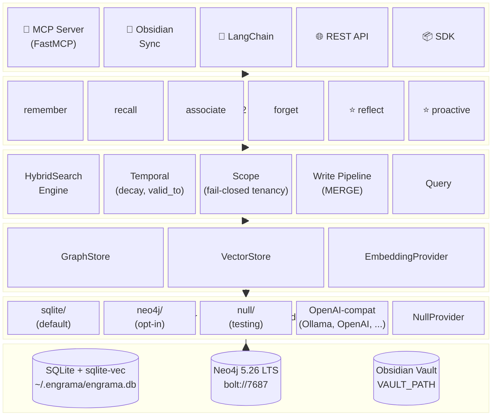
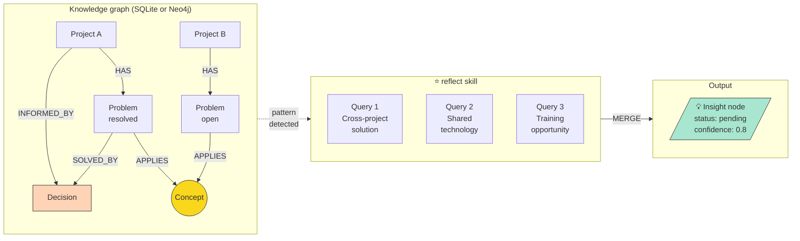
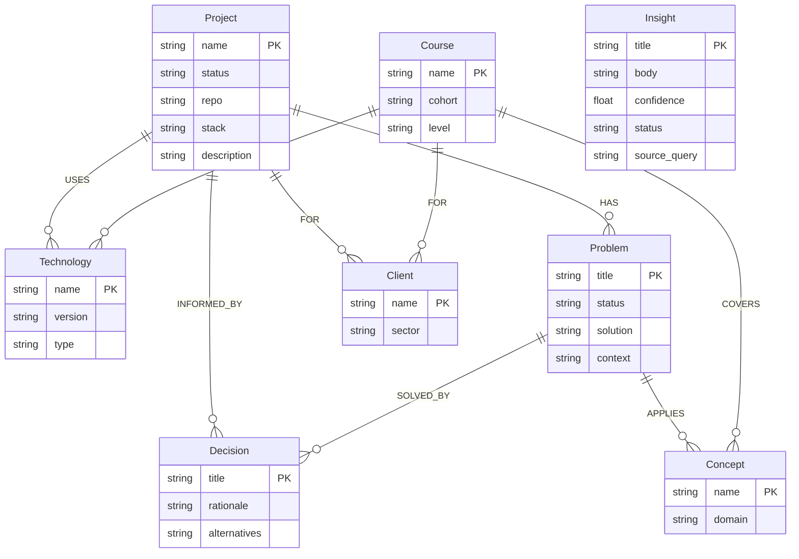
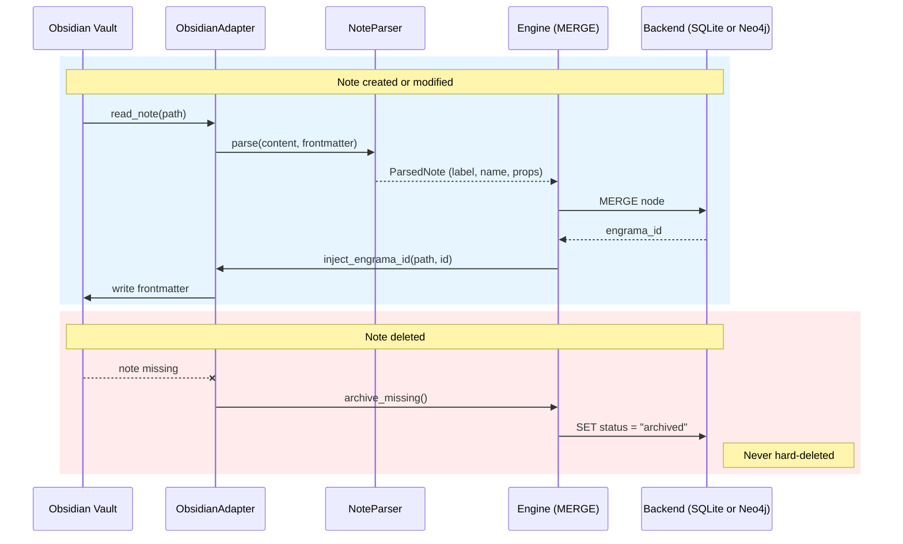

# Architecture

> Primary technical briefing document. Claude Code (and any other coding
> agent) must read this before writing any code.

## Stack

| Component | Technology | Version | Reason |
|---|---|---|---|
| Default backend | SQLite + `sqlite-vec` | 3.40+ / 0.1+ | Zero-dep portable storage (DDR-004) |
| Optional backend | Neo4j Community | 5.26.24 LTS | Multi-process production, large vector indexes |
| Language | Python | ≥ 3.11 | Agent ecosystem, FastMCP compatibility |
| Dependency mgmt | uv | latest | Modern standard, fast |
| MCP adapter | FastMCP + async stores | native | Protocol-based stores, zero Cypher in tools |
| Obsidian adapter | local stdio | — | Document ↔ graph sync |
| Embeddings | OpenAI-compat HTTP | — | Ollama, OpenAI, LM Studio, vLLM, llama.cpp, Jina (DDR-004) |
| Async HTTP | httpx | ≥ 0.27 | Non-blocking embedding calls in MCP server |
| Container (Neo4j only) | Docker Desktop | latest | Reproducible Neo4j infrastructure |
| CI/CD | GitHub Actions | — | Tests and PyPI publishing |
| Packaging | pyproject.toml | — | Published on PyPI as `engrama`; `pip install engrama` or `pip install "engrama[neo4j]"` |

## What makes Engrama different

Engrama is not another MCP wrapper for a single database. It is a
**cognitive framework** combining two complementary memory layers:

- **Obsidian vault** — narrative memory (documents, reasoning, full
  context).
- **Knowledge graph** — relational memory (entities, relationships,
  patterns). Backed by SQLite by default, or Neo4j when scale demands
  it. Identical data model on both.

The `reflect` and `proactive` skills traverse the graph to surface
connections that neither layer could find alone. Example: a Problem in
Project B shares a Concept with a resolved Problem in Project A —
Engrama detects this and proposes the existing Decision as a solution
candidate, without being asked.

## Layer diagram



The factory in `engrama/backends/__init__.py` reads `GRAPH_BACKEND` and
returns the matching implementation. Skills, adapters, and the engine
talk only to the protocols — they don't know which backend is
underneath. See [DDR-004](ddr-004.md) for the rationale and [backends.md](backends.md)
for the user-facing decision guide.

## Data flow: reflect → Insight



The reflect skill emits identical Insight nodes regardless of backend.
Pattern detection on Neo4j uses Cypher; on SQLite each pattern is a
hand-translated SQL query that yields the same rows. The contract suite
in `tests/contracts/` enforces equivalence.

## Graph schema



The schema is defined in `profiles/*.yaml` and applied to whichever
backend is active. SQLite encodes labels in a `label` column on the
`nodes` table; Neo4j uses native node labels. From the application's
point of view this is invisible.

## Directory structure

```
engrama/
├── README.md
├── README_ES.md
├── vision.md
├── architecture.md
├── backends.md              # ★ NEW (DDR-004) — backend decision guide
├── graph-schema.md
├── roadmap.md
├── contributing.md
├── changelog.md
├── ddr-001.md … ddr-004.md
├── pyproject.toml
├── docker-compose.yml       # Neo4j only — not needed for SQLite default
├── .env.example
│
├── engrama/
│   ├── __init__.py
│   │
│   ├── core/
│   │   ├── client.py        # Neo4j driver wrapper (sync)
│   │   ├── engine.py        # Sync write pipeline (MERGE+timestamps)
│   │   ├── protocols.py     # GraphStore / VectorStore / EmbeddingProvider
│   │   ├── schema.py        # Python dataclasses for nodes and relations
│   │   ├── search.py        # HybridSearchEngine — multi-signal scoring
│   │   ├── temporal.py      # Confidence decay, days_since, temporal_score
│   │   └── text.py          # Re-export of node_to_text
│   │
│   ├── backends/            # ★ DDR-004: pluggable backends
│   │   ├── __init__.py      # create_stores() / create_async_stores() factory
│   │   ├── null.py          # NullGraphStore / NullVectorStore (testing)
│   │   ├── sqlite/          # ★ NEW — default backend
│   │   │   ├── store.py     # SqliteGraphStore (sync)
│   │   │   ├── async_store.py # SqliteAsyncStore — mirrors Neo4jAsyncStore contract
│   │   │   ├── vector.py    # SqliteVecStore — sqlite-vec virtual table
│   │   │   └── schema.sql   # Applied automatically on first connect
│   │   └── neo4j/           # Opt-in via `uv sync --extra neo4j`
│   │       ├── backend.py   # Neo4jGraphStore (sync) — SDK / CLI
│   │       ├── async_store.py # Neo4jAsyncStore (async) — MCP server
│   │       └── vector.py    # Neo4jVectorStore — vector index ops
│   │
│   ├── embeddings/
│   │   ├── __init__.py        # create_provider() factory
│   │   ├── null.py            # NullProvider (no embeddings)
│   │   ├── ollama.py          # Legacy convenience wrapper
│   │   ├── openai_compat.py   # ★ NEW — OpenAI / Ollama / LM Studio / vLLM / Jina (DDR-004)
│   │   └── text.py            # node_to_text() — canonical text for embedding
│   │
│   ├── skills/
│   │   ├── remember.py      # MERGE entity + observation
│   │   ├── recall.py        # fulltext search + graph traversal
│   │   ├── associate.py     # create relationships between entities
│   │   ├── reflect.py       # ★ cross-entity pattern detection
│   │   ├── proactive.py     # ★ surfaces Insights without being asked
│   │   └── forget.py        # decay, archiving, TTL
│   │
│   ├── adapters/
│   │   ├── mcp/             # FastMCP server (zero Cypher in tool handlers)
│   │   ├── obsidian/        # ★ vault ↔ graph bidirectional sync (DDR-002)
│   │   └── sdk/             # Engrama Python SDK (context manager)
│   │
│   └── ingest/
│       ├── conversation.py
│       └── web.py
│
├── profiles/
│   ├── base.yaml            # Universal base
│   ├── developer.yaml       # Standalone example
│   └── modules/             # Composable domain modules
│
├── scripts/
│   └── init-schema.cypher   # Neo4j-only; SQLite uses backends/sqlite/schema.sql
│
├── examples/
│   ├── claude_desktop/
│   └── langchain_agent/
│
└── tests/
    ├── conftest.py
    ├── contracts/           # ★ Parametrised over both backends
    │   ├── test_graphstore_contract.py        # sync stores
    │   └── test_async_graphstore_contract.py  # async stores (DDR-004)
    ├── backends/
    │   ├── test_sqlite.py
    │   ├── test_sqlite_async.py
    │   └── test_sqlite_vector.py
    ├── test_core.py
    ├── test_skills.py
    ├── test_adapters.py
    ├── test_obsidian_sync.py
    ├── test_phase4_skills.py
    ├── test_proactive.py
    ├── test_protocols.py
    ├── test_sdk.py
    ├── test_cli.py
    ├── test_composable.py
    ├── test_embeddings.py
    ├── test_openai_compat_embedder.py  # ★ NEW
    ├── test_hybrid_search.py
    ├── test_neo4j_store.py             # async Neo4j integration
    ├── test_temporal.py
    └── test_vector_store.py
```

## Protocol layer and backends

All storage operations go through abstract protocols defined in
`core/protocols.py`: `GraphStore`, `VectorStore`, and
`EmbeddingProvider`. No adapter, skill, or tool writes Cypher or SQL
directly — everything goes through a backend implementation.

There are **two pairs** of backend implementations:

### Sync stores (used by the SDK and CLI through `EngramaEngine`)

- `SqliteGraphStore` (`backends/sqlite/store.py`) — default. Pure
  Python around `sqlite3`. The `SqliteVecStore` shares the same
  connection so vectors live in the same `.db` file.
- `Neo4jGraphStore` (`backends/neo4j/backend.py`) — wraps
  `EngramaClient` (sync `neo4j` driver).

### Async stores (used by the MCP server)

- `SqliteAsyncStore` (`backends/sqlite/async_store.py`) — wraps the
  sync SQLite store and translates each method's return shape so the
  MCP handlers receive the same dict shape regardless of backend.
- `Neo4jAsyncStore` (`backends/neo4j/async_store.py`) — wraps
  `neo4j.AsyncDriver`. Contains **all** Cypher for the MCP tools.
  `server.py` itself contains zero Cypher strings.

`NullGraphStore` and `NullVectorStore` exist for testing and dry-run
mode. New backends (NebulaGraph, ArcadeDB, pgvector, Chroma, LEANN, ...)
can be added by implementing the same protocols.

The `create_stores()` and `create_async_stores()` factories in
`backends/__init__.py` read `GRAPH_BACKEND` / `VECTOR_BACKEND` from
environment (or an explicit config dict) and return the appropriate
implementations.

### The contract suites

Two parameterised pytest suites live in `tests/contracts/`:

- `test_graphstore_contract.py` — runs every behavioural test against
  both sync stores.
- `test_async_graphstore_contract.py` — runs every behavioural test
  against both async stores.

Neo4j tests are skipped when `NEO4J_PASSWORD` is not configured, so the
SQLite-only suite (76 tests) passes on a fresh checkout with no `.env`.
Together they pinned three drift bugs that were caught and fixed during
DDR-004 implementation; the suites exist to make sure they stay fixed.

## Embeddings (DDR-003 Phase B + DDR-004)

`EmbeddingProvider` is implemented by:

- `OpenAICompatibleProvider` (`embeddings/openai_compat.py`) —
  speaks the OpenAI `/v1/embeddings` HTTP shape. Drives OpenAI proper,
  Ollama (`OPENAI_BASE_URL=http://localhost:11434/v1`), LM Studio, vLLM,
  llama.cpp, Jina, or any other compatible service. Sync (`embed`,
  `embed_batch`) and async (`aembed`, `aembed_batch`) methods both use
  `httpx`.
- `OllamaProvider` (`embeddings/ollama.py`) — legacy convenience
  wrapper. Uses Ollama's native `/api/embeddings` endpoint. Kept for
  backwards compatibility with existing `.env` files.
- `NullProvider` (`embeddings/null.py`) — no-op, `dimensions=0`. Used
  when `EMBEDDING_PROVIDER=none` (default). Has both sync and async
  methods.

`node_to_text()` in `embeddings/text.py` builds the text string that
gets embedded.

**Embed-on-write**: when an embedding provider is active,
`engrama_remember` and `engrama_sync_note` automatically embed each
node after merging. The vector is stored:

- **SQLite:** in the `node_embeddings` `vec0` virtual table (same
  `.db` file).
- **Neo4j:** as a `n.embedding` property; nodes get an `:Embedded`
  secondary label so the vector index covers all node types.

## Hybrid search (DDR-003 Phase C; ranking reworked in spec 002)

`HybridSearchEngine` (`core/search.py`) fuses fulltext + vector relevance
with temporal and trust signals. Both sync (`search()`) and async
(`asearch()`) methods are available.

Since spec 002 the default relevance base is **Reciprocal Rank Fusion**
(`fusion_mode="rrf"`), which combines the two channels by *rank* rather than
raw score — so a correct answer surfaces regardless of how the per-channel
score scales differ. Scoring formula (rrf mode):

    final = rrf_score + β × graph_distance + γ × temporal + δ × trust

- `rrf_score`: the rank-fused, [0,1]-normalised relevance base
  (`1/(k + rank)` summed across the channels a node appears in, `k` =
  `ENGRAMA_RRF_K`, default 60).
- `graph_distance`: a typed-graph **node-distance** signal (`graph_rerank`,
  default on) computed over the fused candidate window — result-set
  *cohesion* (a candidate near other strong candidates is boosted, decaying
  per hop) plus, when the query resolves to an in-result *anchor* node, a
  distance boost toward it. Replaces the old degree-count `graph_boost` and
  is scope-filtered (only in-tenant neighbours count). Bounded by
  `ENGRAMA_GRAPH_HOPS` / `ENGRAMA_FANOUT_CAP`.

**Legacy linear blend** — set `ENGRAMA_RANKING_LEGACY=1` (or
`fusion_mode="linear"`) to revert to the pre-spec-002 formula:

    final = α × vector + (1-α) × fulltext + β × graph_boost + γ × temporal + δ × trust

When `EMBEDDING_PROVIDER=none` the vector channel is empty — RRF degrades to
the fulltext channel's order (linear mode forces α to 0). Graceful
degradation: if the embedding service is unreachable the vector branch is
skipped silently and the `degraded`/`mode` signal records it.

Both sync and async stores expose `search_similar` returning a uniform
shape `{node_id, label, name, score, summary, tags, confidence,
updated_at}` so the scorer can populate enrichment fields without a
second round trip — a regression discovered during DDR-004 testing
(see [DDR-004](ddr-004.md) "Risks").

## Temporal reasoning (DDR-003 Phase D)

Every node carries temporal metadata enabling confidence decay, fact
supersession, and time-travel queries:

- `valid_from` (datetime) — when the fact became true. Auto-set on
  creation.
- `valid_to` (datetime) — when the fact was superseded. `null` = still
  true.
- `confidence` (float, 0.0–1.0) — decays over time. Defaults to 1.0.
- `decayed_at` (datetime) — last decay pass.
- `created_at`, `updated_at` — system timestamps (auto-managed).

**Confidence decay** (`engrama decay`): exponential decay
`new_conf = conf × exp(-rate × days_since_update)`.

**Supersession (`valid_to`)**: setting it auto-halves confidence.
Updating a superseded node clears `valid_to` (revival) and logs a
conflict warning.

**Temporal queries** (`query_at_date`): returns nodes where
`valid_from <= date AND (valid_to IS NULL OR valid_to >= date)`.

**Temporal scoring in hybrid search**: the `γ × temporal` term combines
confidence with recency.
`temporal_score = confidence × 2^(-days / half_life)`.
Default γ=0.1 and half_life=30 days.

## Identity and tenancy (Spec 001)

Every node and relation is owned by an `(org_id, user_id)` identity, and
reads are **fail-closed**: a `None`, empty, or half-resolved scope matches
nothing rather than widening to "see all". Engrama does **not** authenticate
— it consumes an identity asserted upstream.

- **Scope helpers** (`core/scope.py`): `scope_filter_cypher` /
  `scope_filter_sql` build the `WHERE` fragment that every read appends. They
  return `(false)` / `(1 = 0)` for an incomplete scope — the single chokepoint
  that makes isolation fail-closed.
- **Per-request resolution** (MCP boundary): the server reads
  `X-Engrama-Org-Id` / `X-Engrama-User-Id` from the request and binds the
  scope for the call. Exactly one header present → `ScopeUnresolved` (reads
  return zero results; writes are rejected). No headers → the process's
  **standalone identity**, computed once at startup (a single-process install
  needs no configuration).
- **Write guard** (`EngramaEngine`): `merge_node` / `merge_relation` raise on
  a direct SDK call that lacks a complete scope, so an SDK bypass can't write
  unscoped rows.
- **CI guard** (`scripts/check_scoped_queries.py`): an AST scan fails the
  build on any new backend query that neither routes through the scope helper
  nor carries an explicit `# scope-exempt: <reason>`. Wired into CI as a
  blocking step.
- **Migration**: `engrama migrate tenancy --owner-sub <sub> --apply` stamps
  ownership onto a pre-0.13 graph whose rows are otherwise invisible under
  fail-closed reads.

See [graph-schema.md](graph-schema.md#identity-fields-all-nodes-and-relations)
for the stored fields and [security.md](security.md#tenant-isolation-multi-tenant)
for the operator-facing isolation model and the admin/cross-tenant tools.

## Obsidian integration (DDR-002)

The vault is the **narrative layer**. The graph is the **relational
layer**. Neither replaces the other.

### Referential integrity via `engrama_id`

Every documented node carries `engrama_id` in its note's YAML
frontmatter. `adapters/obsidian/sync.py` maintains the contract:



### Bidirectional sync

DDR-002 mandates that every relation is mirrored into the source note's
frontmatter `relations` map. Combined with DDR-004 (portable storage),
this means an Obsidian vault is a **portable backup of the entire
graph**: a fresh SQLite install pointed at the same vault rebuilds the
full graph by running `engrama_sync_vault`.

| Operation | Module | Purpose |
|---|---|---|
| Read note | `adapter.py` | Extract content + frontmatter |
| Search notes | `adapter.py` | Find related notes by text |
| List notes | `adapter.py` | Full vault scan |
| Inject engrama_id | `adapter.py` | Bidirectional sync identity |
| `vault_create_note` | `proactive.py` | Write Insight notes back to vault |
| `vault_append_note` | `proactive.py` | Add insight section to existing notes |

## The distinctive skills: reflect + proactive + ingest

`skills/reflect.py` runs **adaptive** cross-entity pattern detection.
Before executing any pattern, it profiles the graph (counts labels with
data) and only runs patterns whose preconditions are met. Seven
detection patterns:

1. **Cross-project solution** — Problems sharing Concepts with resolved
   Problems in other Projects.
2. **Shared technology** — any two entities connected to the same
   Technology via USES/TEACHES/COMPOSED_OF.
3. **Training opportunity** — Vulnerabilities or open Problems linked
   to Concepts that a Course covers.
4. **Technique transfer** — Techniques used in 2+ Domains.
5. **Concept clustering** — 3+ entities sharing a Concept.
6. **Stale knowledge** — nodes >90 days old OR with confidence <0.3,
   still linked to active Projects or Courses.
7. **Under-connected** — nodes with <2 relationships.

Results are written as `Insight` nodes with confidence scaled by
connection strength and entity count. **Previously dismissed AND
approved Insights are never re-surfaced** — the reflect run filters
against `dismissed | approved` so re-running reflect doesn't undo
human review (regression caught and fixed during DDR-004 testing).

`skills/proactive.py` surfaces pending Insights to the agent and writes
them back to Obsidian via `vault_append_note`. The agent proposes — the
human approves. Insights are never acted upon automatically.

**Proactivity triggers** (module-level state in the MCP server):
- After 10+ `engrama_remember` calls since last reflect →
  `proactive_hint` returned.
- `engrama_search` checks for pending Insights related to the query.
- `engrama_reflect` resets the counter.

**Ingestion** (`engrama_ingest`): reads a vault note, raw text, or
conversation transcript and returns the content with entity-extraction
guidance plus deduplication hints (existing nodes in the graph). The
agent then calls `engrama_remember` for each extracted entity —
agent-driven, not opaque.

## MCP adapter

Native MCP server built with FastMCP and the matching async store. All
storage logic lives in `*AsyncStore`; the MCP tool handlers handle
orchestration, validation, vault I/O, and response formatting only.

Fourteen tools:

- `engrama_status` — read-only introspection: vault path, backend,
  embedder, search mode, version, and `admin_tools` (the not-tenant-isolated
  tools, a hint for a multi-tenant gateway). Agents should call this at
  session start when Engrama coexists with other Obsidian-capable MCPs so
  they can disambiguate which server "the vault" refers to before any sync.
- `engrama_search` — hybrid search across the memory graph
- `engrama_remember` — create or update a node (always MERGE)
- `engrama_relate` — create a relationship (handles title-keyed nodes)
- `engrama_context` — retrieve the neighbourhood of a node up to N hops
- `engrama_sync_note` — sync a single Obsidian note to the graph;
  accepts `dry_run=true` to preview the impact without writing
- `engrama_sync_vault` — full vault scan, reconcile all notes;
  accepts `dry_run=true` to project create/update counts and list the
  files that would receive an `engrama_id` injection
- `engrama_ingest` — read content and return extraction guidance
- `engrama_reindex` — detect / classify / re-embed nodes missing their
  vector (embedder was down at write time); scan is scoped to the caller's
  tenant
- `engrama_reflect` — adaptive cross-entity pattern detection → Insight nodes
- `engrama_surface_insights` — read pending Insights for agent presentation
- `engrama_approve_insight` — human approves or dismisses an Insight
- `engrama_write_insight_to_vault` — append approved Insight to Obsidian note
- `engrama_gdpr_forget` — permanently erase the caller's own memory
  (GDPR right-to-erasure); `mode='dry-run'` previews, `mode='apply'` deletes

### `engrama_status` response shape

Stable JSON contract. Fields are absent (rather than `null`) when the
corresponding subsystem is disabled, so an agent can `if "path" in
payload["vault"]:` reliably.

```json
{
  "version": "0.15.0",
  "backend": {
    "name": "sqlite",
    "ok": true,
    "node_count": 1234
  },
  "vault": {
    "configured": true,
    "path": "/abs/path/to/engrama/vault",
    "note_count": 87
  },
  "embedder": {
    "configured": true,
    "provider": "ollama",
    "model": "nomic-embed-text",
    "dimensions": 768
  },
  "search": {
    "mode": "hybrid",
    "degraded": false,
    "reason": ""
  },
  "admin_tools": [
    {"name": "engrama_status",  "reason": "deployment-wide counts; no tenant isolation"},
    {"name": "engrama_reindex", "reason": "tenant-scoped data, but admin-flavoured bulk re-embed"}
  ]
}
```

`backend.name` is normalised — the underlying async stores report
`sqlite-async` / `neo4j-async`, but the tool strips the `-async`
suffix since agents reason about which database is running, not the
SDK shape. `search.degraded` is always `false` for status calls
(degradation is detected mid-`engrama_search`); use this field to
predict what the next search *would* attempt.

The MCP server CLI accepts a `--backend` flag (`sqlite` or `neo4j`)
plus per-backend overrides (`--db-path`, `--neo4j-uri`,
`--neo4j-password`, `--vault-path`). Defaults come from environment.

## Profile system

Profiles are the single source of truth for the graph schema. There are
two modes: standalone profiles and composable modules.

**Standalone** (one YAML, complete schema):
```bash
uv run engrama init --profile developer
```

**Composable** (base + domain modules, recommended for multi-role
users):
```bash
uv run engrama init --profile base --modules hacking teaching photography
```

The base profile (`profiles/base.yaml`) defines universal nodes:
Project, Concept, Decision, Problem, Technology, Person. Domain modules
in `profiles/modules/` add domain-specific nodes and can reference base
labels in their relations. The merge engine unions properties,
deduplicates relations, and validates all endpoints.

Users can create modules for **any** domain — the included modules are
examples, not a fixed set. The onboard skill generates custom modules
through a conversational interview.

## Configuration reference (`.env`)

| Variable | Default | Description |
|---|---|---|
| `GRAPH_BACKEND` | `sqlite` | `sqlite`, `neo4j`, or `null` |
| `VECTOR_BACKEND` | matches graph | `sqlite-vec`, `neo4j`, or `none` (auto if absent) |
| `ENGRAMA_DB_PATH` | `~/.engrama/engrama.db` | SQLite database file |
| `NEO4J_URI` | `bolt://localhost:7687` | Neo4j connection URI |
| `NEO4J_USERNAME` | `neo4j` | Neo4j username |
| `NEO4J_PASSWORD` | — | Neo4j password (required when `GRAPH_BACKEND=neo4j`) |
| `NEO4J_DATABASE` | `neo4j` | Neo4j database name |
| `ENGRAMA_PROFILE` | `developer` | Profile name for schema generation |
| `VAULT_PATH` | `~/Documents/vault` | Obsidian vault root path |
| `EMBEDDING_PROVIDER` | `none` | `none`, `ollama`, or `openai` |
| `EMBEDDING_MODEL` | `nomic-embed-text` | Embedding model name |
| `EMBEDDING_DIMENSIONS` | `768` | Embedding vector size |
| `OPENAI_BASE_URL` | `https://api.openai.com/v1` | OpenAI-compat endpoint |
| `OPENAI_API_KEY` | — | API key (when needed) |
| `OLLAMA_URL` | `http://localhost:11434` | Ollama API endpoint (legacy provider) |
| `HYBRID_ALPHA` | `0.6` | Vector vs fulltext weight |
| `HYBRID_GRAPH_BETA` | `0.15` | Graph topology boost weight |
| `ENGRAMA_ORG_ID` | — | Standalone owning org (Spec 001); unset → derived standalone identity |
| `ENGRAMA_USER_ID` | — | Standalone owning user (Spec 001); unset → derived standalone identity |
| `ENGRAMA_LOCAL_SUB` | — | Seed for the derived standalone identity when org/user are unset |
| `ENGRAMA_TRANSPORT` | `stdio` | MCP transport: `stdio` or `http` (Streamable HTTP, loopback, no auth) |

## Implementation rules

1. **Always `MERGE`, never bare `CREATE`** — prevents duplicates on
   both backends.
2. **Fulltext index is mandatory** — `memory_search` (Neo4j) /
   `nodes_fts` (SQLite) across all text properties.
3. **Timestamps everywhere** — `created_at` and `updated_at` on every
   node.
4. **Embeddings are optional** — graph structure is primary; semantic
   search via OpenAI-compatible providers enhances search when enabled.
5. **Integration tests against both backends** — no mocks for the data
   layer; the contract suite parameterises over SQLite and Neo4j.
6. **Cypher and SQL parameters always** — never string-format queries.
7. **`server.py` contains zero query strings** — all queries live in
   the matching `*AsyncStore`.
8. **Async stores translate shapes** — explicit method-by-method
   delegation, never an opaque `__getattr__` forward (that's how the
   contract drift bug shipped originally; DDR-004 replaced it).

## Related repositories

- `scops/engrama` — this framework.

> **Historical note:** an intermediate `mcp-neo4j` layer was originally
> planned but dropped in favour of a native MCP server. The async
> drivers give full control over MERGE logic, parameter handling, and
> key selection (name vs title) without an extra dependency. DDR-004
> generalised the same approach across SQLite.
